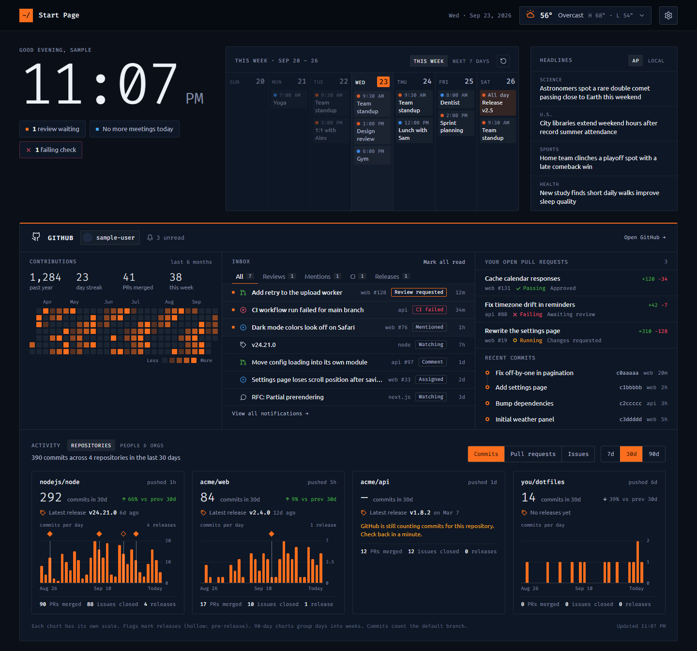
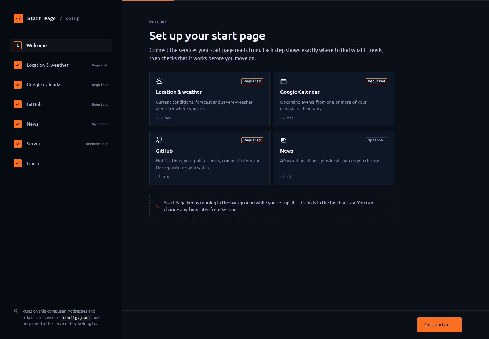
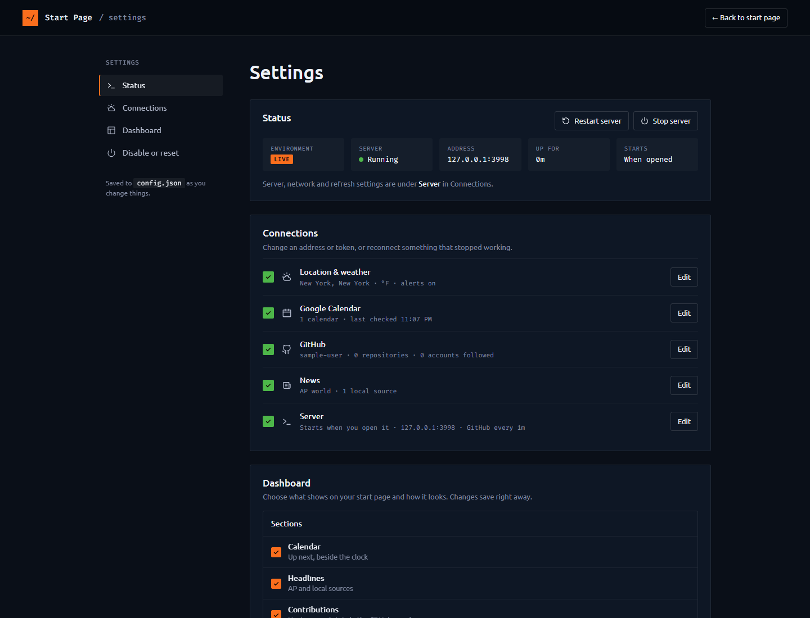

# ~/ Start Page

Start Page is a personal home page for your browser that runs on your own Windows PC. Set it as your browser's home page or new tab page at `http://localhost:3000`.

Start Page isn't a website, and there's no account to create. It's a small program that runs in the background and shows up as an icon in the taskbar tray. Your settings stay on your computer.

*Screenshots use sample data.*

## ~/ Start Page / Getting started

**Requirements:** Windows 10 or 11. You don't need administrator rights, and you don't need to install anything first. If Node.js 18.17 or newer isn't already on your PC, the installer downloads a private copy into the Start Page folder. Nothing is installed system-wide.

1. **Download Start Page.** Clone this repository and unzip it somewhere permanent, such as your Documents folder. Start Page runs from this folder, so don't delete it after installing.
2. **Run `install.bat`.** Double-click it. A window shows each step as it sets up the dependencies, builds the app, adds Start menu and desktop shortcuts, and lists Start Page under **Settings > Apps** in Windows.
3. **Finish setup in your browser.** When the install is done, your browser opens the setup page. It walks you through choosing your location, adding your Google Calendar and connecting GitHub. Each step shows where to find what it needs and checks that it works before you move on. Picking news sources is optional. Last, you choose how Start Page runs:
   - when you sign in to Windows
   - in the background as a service
   - only when you open it

   
4. **Set it as your home page.** In your browser's settings, set the home page or new tab page to `http://localhost:3000`.

### Using Start Page

- **Open it:** click the Start Page icon in the taskbar tray or the Start menu shortcut. If you don't see the icon, Windows may have hidden it under the **^** arrow; you can drag it onto the taskbar to keep it visible.
- **Change your settings:** right-click the tray icon and choose **Settings**, or go to `http://localhost:3000/settings`.
- **Stop it:** right-click the tray icon and choose **Exit**.

The Settings page shows whether Start Page is running and lets you edit each connection. You can also choose which sections appear on your dashboard.

### Updating and uninstalling

- **To find out about updates,** look at the dashboard. Start Page checks GitHub once a day, and **Update available!** appears next to the settings button when there's a new version. It never installs anything by itself. Go to **Settings > Status > Updates** to check right away, see the list of changes since your version, or turn off the daily check.
- **To update,** download the new version into the same folder, or run `git pull`, then run `install.bat` again. Your settings are kept.
- **To uninstall,** find Start Page in **Settings > Apps** and uninstall it, or run `install.bat /uninstall`. This removes the shortcuts, the tray icon and the start-up entry. It leaves the Start Page folder and your settings in place, so delete the folder too if you want to remove everything.

## Your data and privacy

Your settings live in `config.json`, in the Start Page folder. That file holds your GitHub token and your calendars' secret iCal addresses, so keep it private. It's excluded from Git, so it's never committed.

Start Page only accepts connections from your own PC. Your GitHub token is never sent to the browser. The only outside services it contacts are the ones that supply its content:

- **Open-Meteo** for the forecast
- **National Weather Service** for weather alerts
- **Google Calendar**
- **Google News**, AP and local news feeds
- **GitHub**, for your GitHub panel and the daily update check

## For developers

Run **`start.bat`** to start a separate Test copy of Start Page. The server runs in a console window, so you can see its output and errors while you work.

To tell the Test copy and the installed copy apart:

| | Test copy (`start.bat`) | Installed copy (`install.bat`) |
|---|---|---|
| Icons | green | orange |
| Settings page shows | **Test** | **Live** |

To stop the Test copy, press Ctrl+C in its window or choose **Exit** from its tray icon.

You can also run the server with `npm start`.

## License

Start Page is licensed under the [GNU General Public License v3.0](LICENSE).
